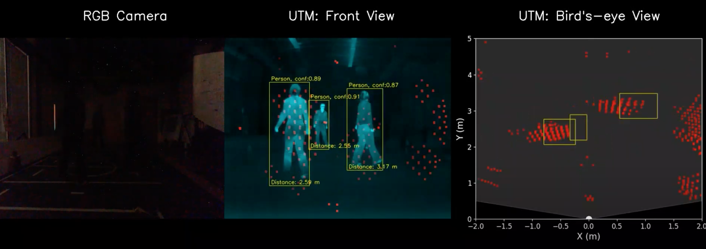

### 🔥 [EWSN'23] Robust Human Detection under Visual Degradation via Thermal and mmWave Radar Fusion

[](https://www.youtube.com/watch?v=W64qrpdN2EU&ab_channel=EWSN23-UTM)
**Click to play** 👆

#### Environment ⚙️
- PyTorch 1.12.0 + CUDA 11.3

#### Dataset 📁
```
chmod +x download_dataset.sh
./download_dataset.sh
```
#### Training 🏋️‍♀️ 
```
py train_fusionc.py --fusion_method=spatial_variance_self_guidence --data=fusion.yaml --cfg=models/yolov5s.yaml --batch=8 --epochs=100  --dropout_rate=0.2 --dropout_on_layer=3,4 --dropout_T=5
```

#### Evaluation 📈
```
python val.py --data=fusion.yaml --weights=[runs/train/xxx/weights/best.pt]  --task=test --save_stat --save_conf --save_txt
```

#### Citation 📝
```
@inproceedings{10.5555/3451271.3451272,
author = {Kaiwen Cai, Qiyue Xia, Peize Li, John Stankovic, Chris Xiaoxuan Lu},
title = {Robust Human Detection under Visual Degradation via Thermal and mmWave Radar Fusion},
year = {2023},
booktitle = {Proceedings of the 2023 International Conference on Embedded Wireless Systems and Networks}
}
```